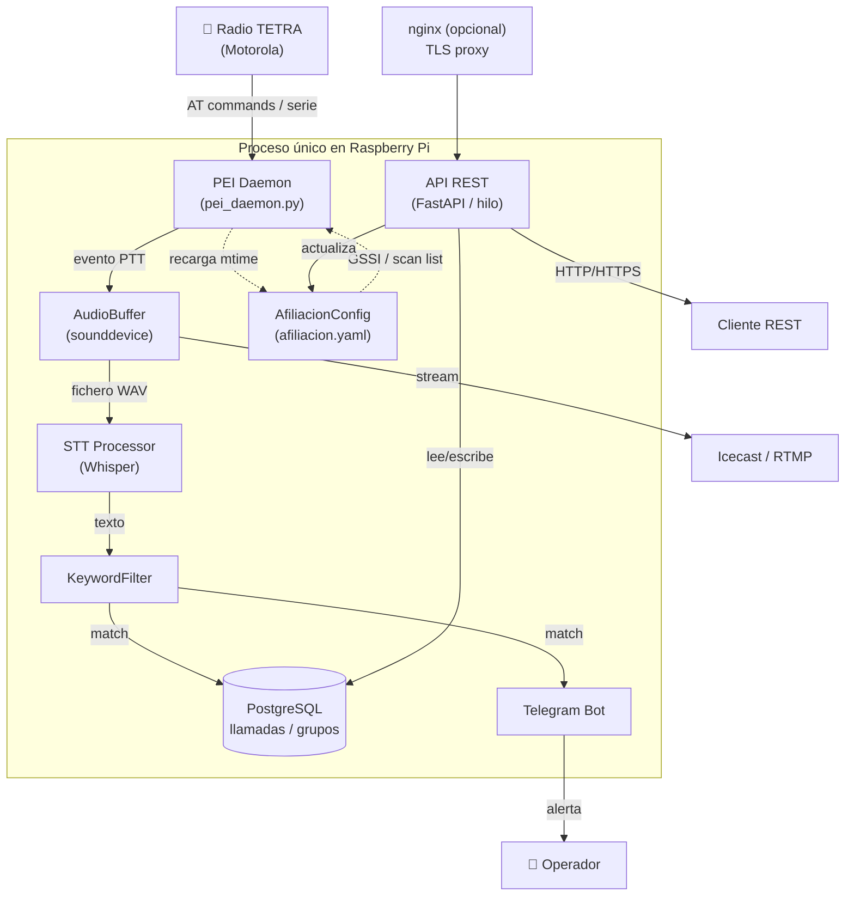

# TETRA Monitor
```
░▀█▀░█▀▀░▀█▀░█▀▄░█▀▀░░░░░█▄█░█▀▀░█▀▀░▀█▀░▀█▀░█▀▀░█▀▄
░░█░░█▀▀░░█░░█▀▄░█▀▀░▄▄▄░█░█░█░░░█░█░░█░░░█░░█░█░█▀▄
░░▀░░▀▀▀░░▀░░▀░▀░▀░▀░░░░░▀░▀░▀▀▀░▀▀▀░▀▀▀░░▀░░▀▀▀░▀░▀
```

Sistema de monitorización de redes TETRA sobre Raspberry Pi. Escucha eventos PTT en tiempo real, transcribe el audio con Whisper, filtra por palabras clave y envía alertas por Telegram.

* 📡 **Captura de eventos TETRA** — Motorola PEI (AT commands sobre serie)
* 🖥️ **Grabación de audio** — `sounddevice` + `soundfile`
* 🗣️ **Speech-to-Text** — OpenAI Whisper
* 📲 **Notificaciones** — Telegram Bot API
* 🗄️ **PostgreSQL** — almacenamiento de llamadas, catálogo de grupos y scan lists
* 🎧 **Streaming de audio** — Icecast o RTMP
* 🔗 **API REST** — FastAPI con autenticación JWT + rate limiting
* 🔒 **HTTPS opcional** — nginx como proxy inverso con TLS

---

## Arquitectura



---

## Instalación

### 1. Clonar el repositorio
```bash
git clone https://github.com/lluisasturies/tetra-monitor.git
cd tetra-monitor
```

### 2. Crear el fichero de configuración
```bash
cp .env.example .env
nano .env
```

Variables necesarias en `.env`:
```env
DB_USER=tetra
DB_PASSWORD=changeme

TELEGRAM_TOKEN=your_token
TELEGRAM_CHAT_ID=your_chat_id

# Genera un secreto seguro con: openssl rand -hex 32
JWT_SECRET=genera_un_secreto_largo_y_aleatorio

API_USER=admin
# Hash bcrypt de la contraseña — genera con: make set-password
API_PASSWORD_HASH=$2b$12$...
```

> `TELEGRAM_TOKEN` y `TELEGRAM_CHAT_ID` solo son obligatorias si `telegram.enabled: true` en `config.yaml`.

### 3. Ejecutar el setup
El script instala automáticamente Python, PostgreSQL, ffmpeg y las dependencias Python, pre-descarga el modelo Whisper y aplica el schema de base de datos. Al final pregunta si instalar HTTPS con nginx:
```bash
make setup
```

### 4. Configurar la contraseña de la API
```bash
make set-password
```
El script pide la contraseña dos veces, genera el hash bcrypt y lo escribe directamente en `.env`.

### 5. (Opcional) Personalizar el catálogo de grupos
Edita `config/grupos.yaml` antes del primer arranque para definir los GSSIs y scan lists de tu red. En el primer arranque se cargan automáticamente en la BD. A partir de entonces el catálogo se gestiona directamente desde la BD (vía API o con `make reload-grupos`).

```yaml
grupos:
  - gssi: 36001
    nombre: "Operaciones"
  - gssi: 36002
    nombre: "Emergencias"

scan_lists:
  - nombre: "ListaScan1"
    grupos: [36001, 36002]
```

---

## Arranque
```bash
make start
```

El daemon PEI y la API REST arrancan juntos en el mismo proceso. La API queda disponible en `http://raspberrypi:8000` (o `https://raspberrypi` si se instaló nginx).

---

## Makefile
```bash
make setup              # Instala dependencias y prepara el entorno
make setup-https        # Instala nginx con TLS (certificado autofirmado)
make set-password       # Genera hash bcrypt y lo guarda en .env
make start              # Arranca el monitor en primer plano
make stop               # Detiene el servicio systemd
make restart            # Reinicia el servicio systemd
make status             # Muestra el estado del servicio systemd
make logs               # Muestra los logs en tiempo real (journalctl)
make logs-file          # Muestra los logs en tiempo real (fichero local)
make install-service    # Instala tetra-monitor como servicio systemd
make uninstall-service  # Elimina el servicio systemd
make update             # git pull + reinicia el servicio si está activo
make reload-grupos      # Recarga catálogo de grupos desde config/grupos.yaml
make backup-db          # Volcado de la BD en data/backups/
```

---

## HTTPS (opcional)
Para exponer la API con TLS usando nginx como proxy inverso:
```bash
make setup-https
```
Genera un certificado autofirmado RSA 4096 bits con validez de 10 años en `/etc/ssl/tetra-monitor/`. La API interna sigue corriendo en `localhost:8000`; nginx escucha en el puerto 443 y redirige HTTP→HTTPS automáticamente.

Sin nginx la API funciona igualmente en HTTP en el puerto 8000.

---

## Systemd (producción)
Para que el daemon arranque automáticamente con la RPi y se reinicie si falla:
```bash
make install-service
sudo systemctl start tetra-monitor
```

`make install-service` genera el unit file con el usuario actual y la ruta del proyecto sin necesidad de editar nada a mano.

```bash
make logs       # logs en tiempo real (journalctl)
make logs-file  # logs en tiempo real (fichero local)
make status     # estado del servicio
make restart    # reiniciar
make stop       # parar
```

---

## Seguridad

| Capa | Mecanismo |
|---|---|
| Autenticación | JWT (access token 1h) + refresh token (7 días, rotación) |
| Contraseña | Hash bcrypt almacenado en `.env` — nunca en texto plano |
| Rate limiting | 5 req/min en login, 30–60 req/min en el resto |
| Transporte | HTTPS con nginx (TLS 1.2/1.3, HSTS) — opcional |
| Comandos AT | Validación regex antes de enviar a la radio |
| Logs | Sin credenciales — username truncado a 32 chars |

---

## Flags de activación
Los siguientes componentes pueden activarse y desactivarse desde `config/config.yaml` sin tocar el código:

| Flag | Sección | Efecto si `false` |
|---|---|---|
| `recording_enabled` | `audio` | No graba ficheros de audio en disco |
| `processing_enabled` | `pei` | Ignora todos los eventos PEI |
| `enabled` | `telegram` | No envía alertas por Telegram |
| `enabled` | `streaming` | No inicia el streaming de audio |

---

## API REST
Todos los endpoints (excepto `/health` y `/auth/*`) requieren autenticación JWT.

### Obtener token
```bash
curl -X POST http://raspberrypi:8000/auth/token \
  -d "username=admin&password=tu_password"
```
Respuesta:
```json
{
  "access_token": "eyJ...",
  "refresh_token": "a3f...",
  "token_type": "bearer",
  "expires_in": 3600
}
```

### Endpoints

| Método | Endpoint | Auth | Descripción |
|---|---|---|---|
| `GET` | `/health` | No | Healthcheck — estado de BD, PEI y Telegram |
| `POST` | `/auth/token` | No | Login — obtener access + refresh token |
| `POST` | `/auth/refresh` | No | Renovar access token con refresh token |
| `POST` | `/auth/logout` | No | Invalidar refresh token |
| `GET` | `/calls` | Sí | Listar llamadas (params: `limit`, `offset`, `gssi`, `ssi`, `texto`) |
| `GET` | `/calls/{id}` | Sí | Detalle de una llamada |
| `GET` | `/afiliacion` | Sí | Ver GSSI y scan list activos en el radio |
| `POST` | `/afiliacion/gssi` | Sí | Cambiar GSSI activo en el radio |
| `POST` | `/afiliacion/scan-list` | Sí | Cambiar scan list activa en el radio |
| `GET` | `/groups` | Sí | Listar catálogo de grupos (param: `solo_activos`) |
| `GET` | `/groups/{gssi}` | Sí | Detalle de un grupo |
| `POST` | `/groups` | Sí | Crear o actualizar un grupo (upsert) |
| `GET` | `/scan-lists` | Sí | Listar scan lists con sus grupos |

---

## Protocolo PEI (ETSI EN 300 392-5)
Los eventos TETRA se parsean según el estándar ETSI:

| Comando AT | Evento | Acción |
|---|---|---|
| `+CTXG` | Transmission Grant | PTT_START / PTT_END |
| `+CDTXC` | Down Transmission Ceased | PTT_END |
| `+CTICN` | Incoming Call Notification | CALL_START (captura GSSI y SSI) |
| `+CTCC` | Call Connect | CALL_CONNECTED |
| `+CTCR` | Call Release | CALL_END |
| `+CTXD` | Transmit Demand | TX_DEMAND |

> **Nota:** Los índices de parámetros de `+CTICN` dependen del perfil `+CTSDC` configurado en la radio. Verificar con logs reales del puerto serie antes de poner en producción.

---

## Licencia
Apache 2.0 — © 2026 Lluis de la Rubia / LluisAsturies
