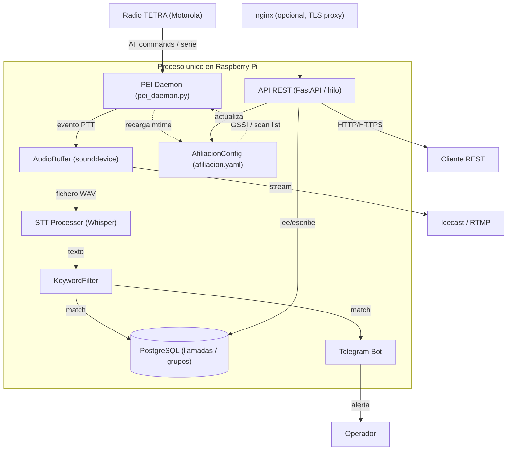

# TETRA Monitor
```
░▀█▀░█▀▀░▀█▀░█▀▄░█▀▀░░░░░█▄█░█▀▀░█▀▀░▀█▀░▀█▀░█▀▀░█▀▄
░░█░░█▀▀░░█░░█▀▄░█▀▀░▄▄▄░█░█░█░░░█░█░░█░░░█░░█░█░█▀▄
░░▀░░▀▀▀░░▀░░▀░▀░▀░▀░░░░░▀░▀░▀▀▀░▀▀▀░▀▀▀░░▀░░▀▀▀░▀░▀
```

Sistema de monitorizacion de redes TETRA sobre Raspberry Pi. Escucha eventos PTT en tiempo real, transcribe el audio con Whisper, filtra por palabras clave y envia alertas por Telegram.

* Captura de eventos TETRA — Motorola PEI (AT commands sobre serie)
* Grabacion de audio — `sounddevice` + `soundfile`
* Speech-to-Text — OpenAI Whisper
* Notificaciones — Telegram Bot API + Email (SMTP)
* PostgreSQL — almacenamiento de llamadas, catalogo de grupos y scan lists
* Streaming de audio — Icecast o RTMP
* API REST — FastAPI con autenticacion JWT + rate limiting
* HTTPS opcional — nginx como proxy inverso con TLS

---

## Arquitectura



---

## Instalacion

### 1. Clonar el repositorio
```bash
git clone https://github.com/lluisasturies/tetra-monitor.git
cd tetra-monitor
```

### 2. Inicializar los ficheros de configuracion
```bash
make init
```

Esto copia de una vez todos los ficheros `.example` a su version local:

| Fichero generado | Plantilla |
|---|---|
| `config/config.yaml` | `config/config.yaml.example` |
| `config/keywords.yaml` | `config/keywords.yaml.example` |
| `config/afiliacion.yaml` | `config/afiliacion.yaml.example` |
| `config/grupos.yaml` | `config/grupos.yaml.example` |
| `.env` | `.env.example` |

Ninguno de estos ficheros se versiona — estan en `.gitignore`. Si ya existen con contenido, `make init` los omite sin sobreescribir.

A continuacion edita cada fichero con tus valores reales.

### 3. Ejecutar el setup
El script instala automaticamente Python, PostgreSQL, ffmpeg y las dependencias Python, pre-descarga el modelo Whisper y aplica el schema de base de datos. Al final pregunta si instalar HTTPS con nginx:
```bash
make setup
```

### 4. Configurar la contrasena de la API
```bash
make set-password
```
El script pide la contrasena dos veces, genera el hash bcrypt y lo escribe directamente en `.env`.

### 5. Variables necesarias en `.env`
```env
DB_USER=tetra
DB_PASSWORD=changeme

TELEGRAM_TOKEN=your_token
TELEGRAM_CHAT_ID=your_chat_id

# Genera un secreto seguro con: openssl rand -hex 32
JWT_SECRET=genera_un_secreto_largo_y_aleatorio

API_USER=admin
# Hash bcrypt de la contrasena — genera con: make set-password
API_PASSWORD_HASH=$2b$12$...
```

> `TELEGRAM_TOKEN` y `TELEGRAM_CHAT_ID` solo son obligatorias si `features.telegram_enabled: true` en `config.yaml`.
> `EMAIL_USER` y `EMAIL_PASSWORD` solo son obligatorias si `features.email_enabled: true` en `config.yaml`.

---

## Arranque
```bash
make start
```

El daemon PEI y la API REST arrancan juntos en el mismo proceso. La API queda disponible en `http://raspberrypi:8000` (o `https://raspberrypi` si se instalo nginx).

---

## Makefile
```bash
make init               # Copia todos los ficheros .example a su config local
make setup              # Instala dependencias y prepara el entorno
make setup-https        # Instala nginx con TLS (certificado autofirmado)
make set-password       # Genera hash bcrypt y lo guarda en .env
make start              # Arranca el monitor en primer plano
make stop               # Detiene el servicio systemd
make restart            # Reinicia el servicio systemd
make status             # Muestra el estado del servicio systemd
make logs               # Muestra los logs en tiempo real (journalctl)
make logs-file          # Muestra los logs en tiempo real (fichero local)
make install-service    # Instala tetra-monitor como servicio systemd
make uninstall-service  # Elimina el servicio systemd
make update             # git pull + reinicia el servicio si esta activo
make reload-grupos      # Recarga catalogo de grupos desde config/grupos.yaml
make backup-db          # Volcado de la BD en data/backups/
```

---

## HTTPS (opcional)
Para exponer la API con TLS usando nginx como proxy inverso:
```bash
make setup-https
```
Genera un certificado autofirmado RSA 4096 bits con validez de 10 anos en `/etc/ssl/tetra-monitor/`. La API interna sigue corriendo en `localhost:8000`; nginx escucha en el puerto 443 y redirige HTTP a HTTPS automaticamente.

Sin nginx la API funciona igualmente en HTTP en el puerto 8000.

---

## Systemd (produccion)
Para que el daemon arranque automaticamente con la RPi y se reinicie si falla:
```bash
make install-service
sudo systemctl start tetra-monitor
```

`make install-service` genera el unit file con el usuario actual y la ruta del proyecto sin necesidad de editar nada a mano.

```bash
make logs       # logs en tiempo real (journalctl)
make logs-file  # logs en tiempo real (fichero local)
make status     # estado del servicio
make restart    # reiniciar
make stop       # parar
```

---

## Seguridad

| Capa | Mecanismo |
|---|---|
| Autenticacion | JWT (access token 1h) + refresh token (7 dias, rotacion) |
| Contrasena | Hash bcrypt almacenado en `.env` — nunca en texto plano |
| Rate limiting | 5 req/min en login, 30-60 req/min en el resto |
| Transporte | HTTPS con nginx (TLS 1.2/1.3, HSTS) — opcional |
| Comandos AT | Validacion regex antes de enviar a la radio |
| Logs | Sin credenciales — username truncado a 32 chars |

---

## Flags de activacion
Todos los flags de activacion estan centralizados en la seccion `features` de `config/config.yaml`:

| Flag | Efecto si `false` |
|---|---|
| `features.recording_enabled` | No graba ficheros de audio en disco |
| `features.processing_enabled` | Ignora todos los eventos PEI |
| `features.streaming_enabled` | No inicia el streaming de audio |
| `features.save_all_calls` | Solo guarda llamadas con keyword detectada |
| `features.telegram_enabled` | No envia alertas por Telegram |
| `features.email_enabled` | No envia notificaciones por email |

---

## API REST
Todos los endpoints (excepto `/health` y `/auth/*`) requieren autenticacion JWT.

### Obtener token
```bash
curl -X POST http://raspberrypi:8000/auth/token \
  -d "username=admin&password=tu_password"
```
Respuesta:
```json
{
  "access_token": "eyJ...",
  "refresh_token": "a3f...",
  "token_type": "bearer",
  "expires_in": 3600
}
```

### Endpoints

| Metodo | Endpoint | Auth | Descripcion |
|---|---|---|---|
| `GET` | `/health` | No | Healthcheck — estado de BD, PEI y Telegram |
| `POST` | `/auth/token` | No | Login — obtener access + refresh token |
| `POST` | `/auth/refresh` | No | Renovar access token con refresh token |
| `POST` | `/auth/logout` | No | Invalidar refresh token |
| `GET` | `/calls` | Si | Listar llamadas (params: `limit`, `offset`, `gssi`, `ssi`, `texto`) |
| `GET` | `/calls/{id}` | Si | Detalle de una llamada |
| `GET` | `/keywords` | Si | Listar keywords activas |
| `POST` | `/keywords` | Si | Anadir keyword con recarga en caliente |
| `DELETE` | `/keywords/{keyword}` | Si | Eliminar keyword con recarga en caliente |
| `GET` | `/afiliacion` | Si | Ver GSSI y scan list activos en el radio |
| `POST` | `/afiliacion/gssi` | Si | Cambiar GSSI activo en el radio |
| `POST` | `/afiliacion/scan-list` | Si | Cambiar scan list activa en el radio |
| `GET` | `/groups` | Si | Listar catalogo de grupos (param: `solo_activos`) |
| `GET` | `/groups/{gssi}` | Si | Detalle de un grupo |
| `POST` | `/groups` | Si | Crear o actualizar un grupo (upsert) |
| `GET` | `/folders` | Si | Listar carpetas con grupos anidados |
| `GET` | `/folders/{id}` | Si | Detalle de una carpeta |
| `POST` | `/folders` | Si | Crear o actualizar una carpeta |
| `PUT` | `/folders/{id}/groups` | Si | Reemplazar grupos de una carpeta |
| `DELETE` | `/folders/{id}` | Si | Eliminar una carpeta |
| `GET` | `/scan-lists` | Si | Listar scan lists con sus grupos |

---

## Protocolo PEI (ETSI EN 300 392-5)
Los eventos TETRA se parsean segun el estandar ETSI:

| Comando AT | Evento | Accion |
|---|---|---|
| `+CTXG` | Transmission Grant | PTT_START / PTT_END |
| `+CDTXC` | Down Transmission Ceased | PTT_END |
| `+CTICN` | Incoming Call Notification | CALL_START (captura GSSI y SSI) |
| `+CTCC` | Call Connect | CALL_CONNECTED |
| `+CTCR` | Call Release | CALL_END |
| `+CTXD` | Transmit Demand | TX_DEMAND |

> **Nota:** Los indices de parametros de `+CTICN` dependen del perfil `+CTSDC` configurado en la radio. Verificar con logs reales del puerto serie antes de poner en produccion.

---

## Licencia
Apache 2.0 — 2026 Lluis de la Rubia / LluisAsturies
